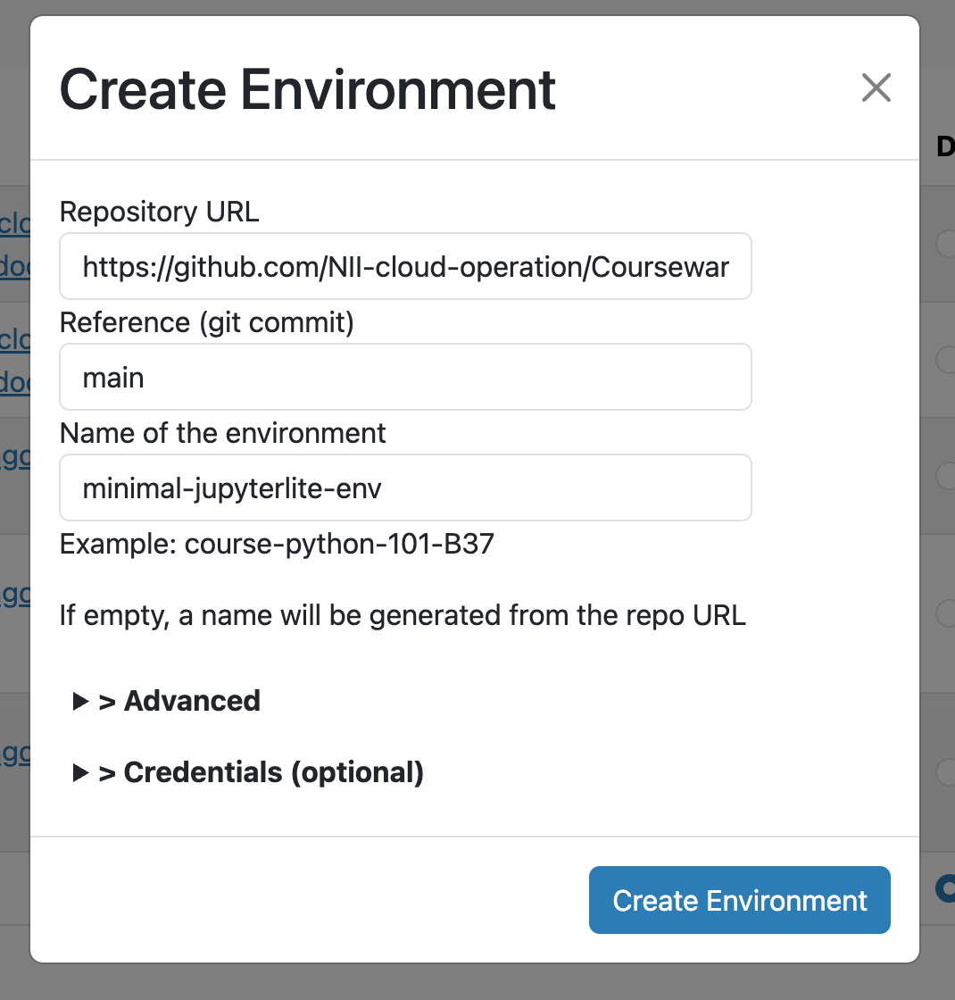
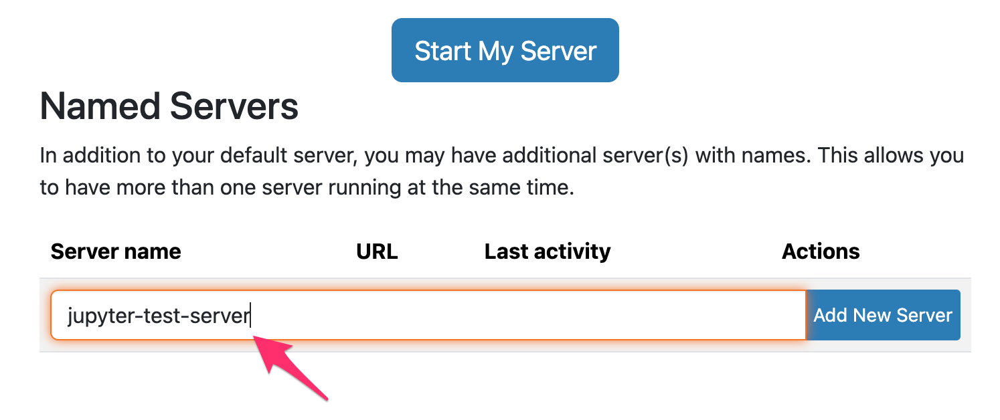
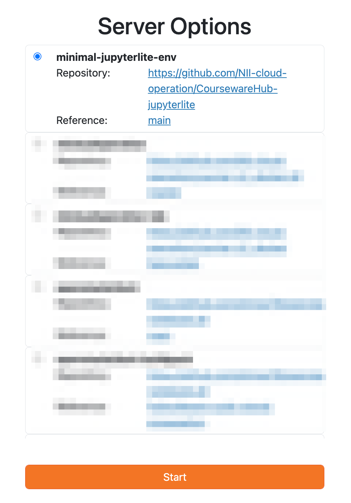
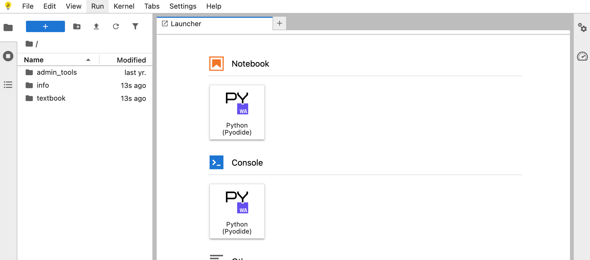

# CoursewareHub-jupyterlite

JupyterLite (Pyodide kernel) を [CoursewareHub](https://coursewarehub.github.io/) 環境で起動することを想定した repo2docker 用イメージ定義です。

## CoursewareHub での使い方

CoursewareHub の `repo2docker` 画面からこのリポジトリを指定して環境イメージを作成します。

1. CoursewareHub にログインし、 `(domain)/hub/home` を開く
2. ツールバーの **Environments** をクリック
3. **Add New** をクリックして **Create Environment** ダイアログを開く
4. 以下を入力して **Create Environment** をクリック
   - **Repository URL**: `https://github.com/NII-cloud-operation/CoursewareHub-jupyterlite`
   - **Reference (git commit)**: `main`
   - **Name of the environment**: 任意（例: `minimal-jupyterlite-env`）

### サーバーの起動

ビルドが完了したら、 `(domain)/hub/home` から以下の手順でサーバーを起動します。

1. **Named Servers** セクションでサーバー名を入力し、 **Add New Server** をクリック

   

2. **Server Options** ダイアログで先ほど作成した環境（例: `minimal-jupyterlite-env`）を選択し、 **Start** をクリック

   

起動すると、Pyodide カーネルで動作する JupyterLite が表示されます。CoursewareHub 上のコンテンツにアクセスできるよう設定しているため、 `textbook` など CoursewareHub が用意するファイルをそのまま参照・利用できる点がポイントです。

## 構成ファイル

- `apt.txt` — apt でインストールするパッケージ。CoursewareHub では root 権限の処理に `sudo` を使用するため含めています。
- `environment.yml` — conda 環境定義（`conda-forge` チャネル）
- `postBuild` — `jupyterlite-pyodide-server` を pip インストールし、JupyterLite サイトを `/tmp/jupyterlite` にビルド
- `start` — CoursewareHub 用の起動ラッパースクリプト。コンテナ起動時の UID/GID 調整など CoursewareHub 環境で必要な処理を行い、加えて `JUPYTERLITE_OUTPUT_DIR` を設定して JupyterLite の出力先を指定します。
